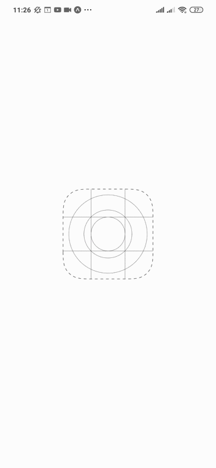

<h1 align="center">
    Blog Post App
</h1>

<h1 style="display:flex; justify-content:space-between" >
    
    
</h1>


---

# 📖About
A simple project using React Native and Expo. The main goal is to pratice **React Hooks** useReducer, useState and useEffect. Inside off our aplication we have 4 different screens, each one has one particular job: Create a new post, Edit a post, Show a particular post and Show all post and delete.

---

# 🚀Features

- ⚛ [React Native](https://reactnative.dev/)
- 💹 [Json](https://www.json.org/json-pt.html) and [Ngrok](https://ngrok.com/)
- ♻ [Axios](https://github.com/axios/axios)

---

# ⚡Getting Started

``` bash

    $ git clone https://github.com/Givs/Blog-App.git

    $ cd Blog-App

    $ npm i 

    $ npm start

```
# 🚩More
This project use a little server to deal with the posts. With ngrok we can create a URL to communicate our mobile device with the API. You can also clone [this repo](https://github.com/Givs/Json-Server.git) and follow the settings. 
    
